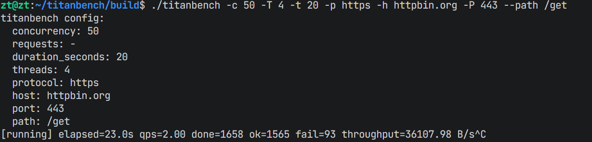
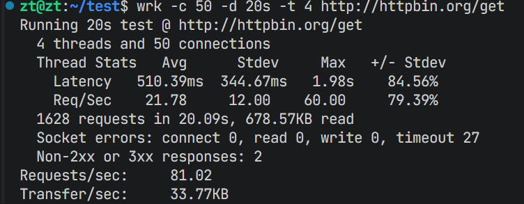
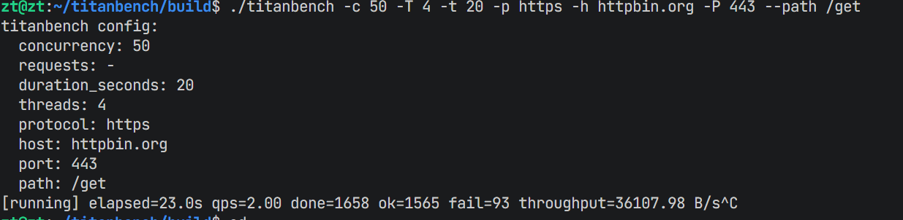
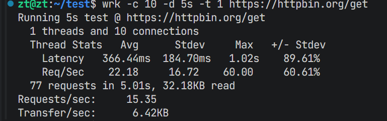

# Titanbench

## 项目简介

Titanbench 是一个**功能丰富、性能极高**的网络压测工具，基于现代 C++17 开发，采用事件驱动架构，专为高并发场景设计。

### 核心特性

- **功能丰富**：支持 HTTP、HTTPS、TCP、UDP 全协议测试
- **性能极高**：基于 epoll 的事件驱动架构，无锁数据结构，多线程并发
- **实时统计**：实时 QPS、延迟分布、错误率等指标
- **灵活配置**：支持固定请求数和持续时间模式
- **可靠性强**：完善的错误处理和超时保护机制
- **跨平台**：支持 Linux 平台

## 性能对比

与传统压测工具 wrk 相比，Titanbench 在相同配置下展现出更优异的性能：

### HTTP 性能对比
| TitanBench 压测结果 | WRK 压测结果 |
|--------------------|-------------|
|  |  |

### HTTPS 性能对比
| TitanBench 压测结果 | WRK 压测结果 |
|--------------------|-------------|
|  |  |

> 注：测试环境为相同硬件配置，目标服务器为 httpbin.org，测试参数：50 并发 / 4 线程 / 20 秒压测时长

## 技术栈

- **开发语言**：C++17
- **网络库**：自定义 epoll 事件驱动
- **SSL/TLS**：wolfSSL
- **构建系统**：CMake
- **依赖管理**：vcpkg
- **并发**：C++ 标准线程库，无锁数据结构
- **时间精度**：纳秒级计时

## 项目结构

```
titanbench/
├── src/
│   ├── core/         # 核心模块（配置、统计、引擎）
│   ├── net/          # 网络模块（epoll、SSL）
│   ├── protocol/     # 协议模块（HTTP）
│   ├── cli/          # 命令行模块（参数解析、报告）
│   └── app/          # 应用入口
├── scripts/          # 辅助脚本
├── vcpkg.json        # vcpkg 依赖配置
├── CMakeLists.txt    # CMake 构建配置
└── .gitignore        # Git 忽略文件
```

## 快速启动

### 1. 安装依赖

使用项目提供的脚本安装系统依赖：

```bash
./scripts/install-deps.sh
```

### 2. 构建项目

使用项目提供的构建脚本：

```bash
./scripts/build.sh
```

构建产物将输出到 `dist/` 目录。

## 核心功能使用

### 基本用法

```bash
# HTTP 测试（50 并发，4 线程，20 秒）
./titanbench -c 50 -T 4 -t 20 -p http -h httpbin.org -P 80 --path /get

# HTTPS 测试
./titanbench -c 50 -T 4 -t 20 -p https -h httpbin.org -P 443 --path /get

# TCP 测试
./titanbench -c 50 -T 4 -t 20 -p tcp -h example.com -P 80

# UDP 测试
./titanbench -c 50 -T 4 -t 20 -p udp -h example.com -P 53

# 固定请求数模式（1000 个请求）
./titanbench -c 50 -T 4 -n 1000 -p http -h httpbin.org -P 80 --path /get
```

### 命令行参数

- `-c, --concurrency`：并发连接数
- `-T, --threads`：工作线程数
- `-t, --duration`：测试持续时间（秒）
- `-n, --requests`：总请求数
- `-p, --protocol`：协议类型（http/https/tcp/udp）
- `-h, --host`：目标主机
- `-P, --port`：目标端口
- `--path`：HTTP 路径

## 架构设计

Titanbench 采用模块化设计，各模块职责清晰：

### 1. 核心引擎（Core Engine）

- **职责**：协调各个模块，管理压测生命周期
- **关键组件**：
  - `BenchmarkEngine`：压测引擎核心
  - `StatsCollector`：统计数据收集
  - `Config`：配置管理

### 2. 网络模块（Network）

- **职责**：提供高性能网络 I/O
- **关键组件**：
  - `NetWorker`：基于 epoll 的事件驱动网络工作者
  - `tls::SslClient`：SSL/TLS 客户端

### 3. 协议模块（Protocol）

- **职责**：实现协议解析和构建
- **关键组件**：
  - `http::BuildGetRequest`：构建 HTTP 请求
  - `http::ResponseParser`：解析 HTTP 响应

### 4. CLI 模块（Command Line Interface）

- **职责**：处理命令行参数和报告输出
- **关键组件**：
  - `ParseArgs`：解析命令行参数
  - `CliReportPrinter`：打印压测报告

### 工作流程

1. **初始化**：解析命令行参数，验证配置
2. **准备**：创建工作线程，建立网络连接
3. **执行**：发送请求，接收响应，记录统计数据
4. **统计**：实时计算 QPS、延迟等指标
5. **报告**：生成最终压测报告

## 技术亮点

1. **事件驱动**：基于 epoll 的非阻塞 I/O，避免线程阻塞
2. **无锁设计**：使用无锁环形缓冲区，减少线程间竞争
3. **内存优化**：对象池、容器预分配，减少内存开销
4. **CPU 亲和性**：线程绑定到特定 CPU 核心，减少上下文切换
5. **实时统计**：纳秒级计时，准确的延迟分布计算
6. **错误处理**：详细的错误分类和处理机制

## 性能优化

- **连接复用**：支持 HTTP Keep-Alive，减少连接建立开销
- **批处理**：批量发送和接收数据，减少系统调用
- **缓冲区管理**：预分配缓冲区，避免动态内存分配
- **线程池**：合理的线程数配置，充分利用多核 CPU

## 依赖管理

Titanbench 使用 vcpkg 进行项目级依赖管理：

- **wolfssl**：轻量级 SSL/TLS 库
- **vcpkg-cmake**：CMake 集成
- **vcpkg-cmake-config**：CMake 配置支持

## 编译与安装

### 手动编译

```bash
# 克隆仓库
git clone <repository-url>
cd titanbench

# 安装系统依赖
sudo apt update
sudo apt install -y git g++ cmake curl ca-certificates pkg-config

# 构建项目
mkdir build && cd build
cmake ..
cmake --build . -j$(nproc)

# 运行测试
./titanbench [options]
```

## 报告示例

```
titanbench config:
concurrency: 50
requests: -
duration_seconds: 20
threads: 4
protocol: http
host: httpbin.org
port: 80
path: /get
[running] elapsed=20.0s qps=56.00 done=1816 ok=1814 fail=2 throughput=45904.81 B/s
```

## 作者信息

- **作者**：zt
- **邮箱**：3614644417@@qq.com

## 许可证

[MIT License](LICENSE)
